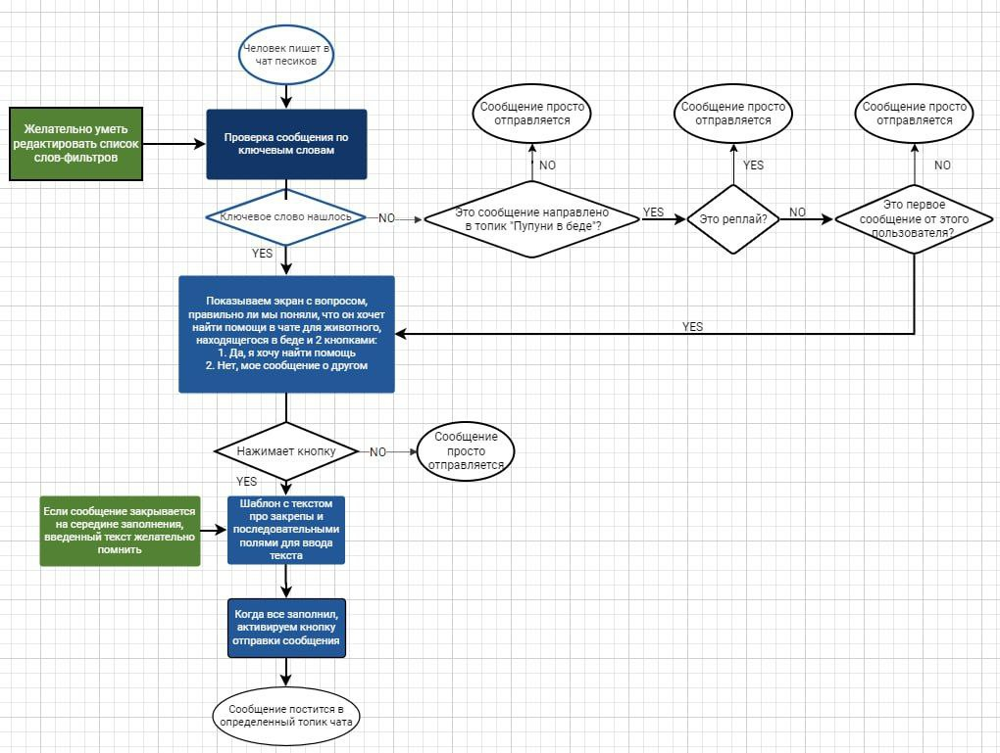

# <t><b>Шаблон</b> </t>

Здравствуйте, %USERNAME%!

Спасибо, что вы неравнодушны и заботитесь о животных!

Перед тем, как отправлять сообщение, прочтите, пожалуйста, закрепы:
№1 https://t.me/kuce_beograd/40554/46135,
№2 https://t.me/kuce_beograd/40554/48577,
№3 https://t.me/kuce_beograd/40554/40687

Если это не помогло, пожалуйста, оформите ваше сообщение по шаблону:

1. О животном

* Кошка/собака/иное
* Количество животных

2. Актуальное положение дел

* Состояние животного (в норме/болен/иное)
* Есть ли укрытие
* Есть ли еда, вода
* Иное

3. Локация

В идеале - приложите геолокацию, точку на карте

4. Что вы лично можете сделать для этого животного?

* Логистика (такси/личное авто)
* Оплата лечения, оплата передержки
* Кураторство
* Забрать к себе
* Иное

5. Какой помощи ждете?

* Логистика (такси/личное авто)
* Оплата лечения, оплата передержки
* Кураторство
* Забрать к себе
* Иное

6. Прикрепите фото животного

**_Upd дополнено вариантами от Ильи_**

пристроить 
нашл? (чтобы ловились все окончания) 
бездомн* 
ничейн* 
ничья(ей,ьи,ье) 
уличн*  (сомневаюсь, мб ложные срабатывания) 
приют (сомневаюсь, мб ложные срабатывания) 
бега?т*улиц* (чтобы ловились фразы вида некто бегает(ют,ть) на улиц(е, ах)) 
сид?т*улиц* 
ход?т*улиц* 
забрать + бездомный + может + кто(то) - в любых сочетаниях, но все 4 в одном посте 
кто-то (кто то) + помочь  (разные окончания у глагола) 
кто-то (кто то) + забрать (разные окончания у глагола) 
кто-то (кто то) + выкинул (разные окончания у глагола) 
кто-то (кто то) + спасти (разные окончания у глагола) 
"волонтеры?" - именно со знаком вопрос 
помоч? 
помощ? 
спас* 
пристро* 
приучен? 

*хелп*

ищу
*терял*